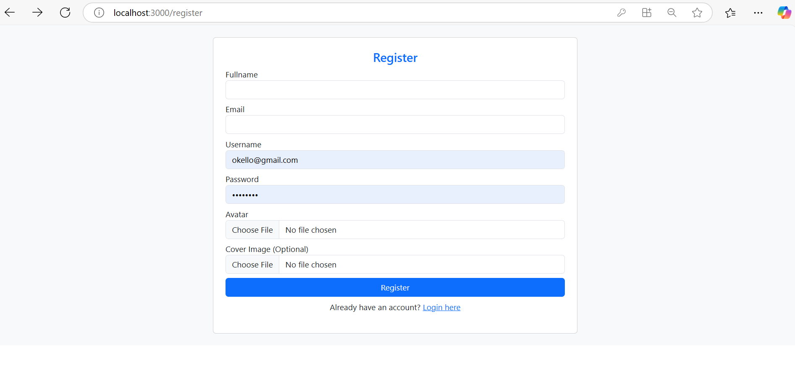
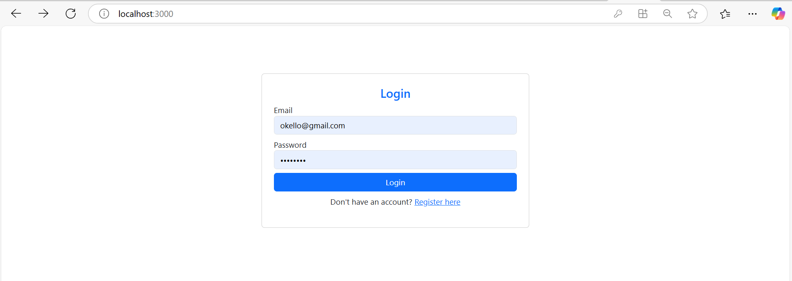

---

# Project Documentation

## Overview

This project consists of three main components:

1. **UserAPI**: Handles user registration and replicates the data to Business Central via a method exposed as a web service.
2. **UserAPIClient**: The front-end application where users can register or log in by entering their details.
3. **Webservice**: Exposes a codeunit as a web service via an OData API, which Business Central uses to sync data.

## Components

### 1. **UserAPI**

The **UserAPI** component is a backend API that handles user registration and authentication. It does the following:

- Registers a user by capturing their email, username, and password.
- Hashes the password for security before storing it in the database.
- Syncs the newly created user data to **Business Central** via an OData API (exposed as a web service).

The API is accessible for client-side requests and uses `bcrypt` for password hashing. The registration process also replicates the user's information (username, email, and fullname) to Business Central.

### 2. **UserAPIClient**

The **UserAPIClient** is the front-end application. It allows users to:

- Register an account by entering their email, username, and password.
- Log in using their credentials.
- View the registration or login success screen once authenticated.

The UI includes a form for user registration and login, which sends requests to the **UserAPI** backend for processing.




### 3. **Webservice**

The **Webservice** component is a Business Central **codeunit** that is exposed via an OData API. This codeunit handles the insertion of user data into the **User API** table of Business Central. It is accessible through a URL in Postman or any other HTTP client.

#### Codeunit Example

The following is the codeunit exposed as a web service in **Business Central**:

```al
/// <summary>
/// Test API in Postman
/// Publish this code and go to Web Services page and create new then choose this codeunit
/// Put the link below in postman to test your web service that was published
/// {hostname}/{server_instance_name}/ODataV4/{serviceName}_{procedureName}?company={companyName|companyId}
/// http://localhost:7048/BC250/ODataV4/WEBSERVICE_TestAPI?company=CRONUS%20International%20Ltd.
/// This link is called in the API
/// </summary>
[ServiceEnabled]
procedure TestAPI(username: Text; email: Text; fullname: Text) Result: Text
var
    UserAPITable: Record "User API";
begin
    UserAPITable.Init();
    UserAPITable.username := username;
    UserAPITable.email := email;
    UserAPITable.fullname := fullname;
    UserAPITable.Insert();
    Result := username + email + fullname;
end;
```

This codeunit, when published as a web service in Business Central, is accessible via the following URL format:

```
http://localhost:7048/BC250/ODataV4/WEBSERVICE_TestAPI?company=CRONUS%20International%20Ltd.
```

Once the web service is published, it can be called via an API request from the **UserAPI** backend.

### Workflow

1. **User Registration**: 
   - A user fills in the registration form on the **UserAPIClient**.
   - The client sends the user’s data (username, email, password) to the **UserAPI** backend.
   - The **UserAPI** hashes the password, stores the data in the database, and calls the **Business Central Webservice** to replicate the data to Business Central.

2. **User Authentication**:
   - The user logs in using their username/email and password.
   - The **UserAPI** validates the credentials by comparing the entered password with the hashed password in the database.
   - If the credentials are valid, the **UserAPI** generates and sends authentication tokens (access token and refresh token) to the client.

3. **Data Sync to Business Central**:
   - The **UserAPI** backend calls the **Business Central Webservice** (via OData API) to insert the new user data into Business Central's "User API" table.
   - The data is successfully replicated and stored in Business Central.

---

## API Documentation

### **UserAPI Endpoints**

1. **POST /register**
   - **Description**: Registers a new user by accepting username, email, and password.
   - **Request Body**:
     ```json
     {
       "username": "string",
       "email": "string",
       "password": "string"
     }
     ```
   - **Response**:
     ```json
     {
       "message": "User registered successfully",
       "user": {
         "username": "string",
         "email": "string"
       }
     }
     ```

2. **POST /login**
   - **Description**: Authenticates a user by validating their credentials and returning authentication tokens.
   - **Request Body**:
     ```json
     {
       "email": "string",
       "username": "string",
       "password": "string"
     }
     ```
   - **Response**:
     ```json
     {
       "message": "User logged in successfully",
       "accessToken": "string",
       "refreshToken": "string",
       "user": {
         "username": "string",
         "email": "string"
       }
     }
     ```

---

## Setting Up the Environment

### Environment Variables

To configure this project, you need to add the following variables to your `.env` file:

```env
BC_URL=http://localhost:7048/BC250/ODataV4/WEBSERVICE_TestAPI?company=CRONUS%20International%20Ltd.
BC_USERNAME=econsultant
BC_PASSWORD='^droitLTD2025'
```

Make sure to:

1. Install `dotenv` for managing environment variables.
2. Include the `.env` file in `.gitignore` to keep sensitive data safe.

---

## How to Test the Web Service

1. **Publish the Codeunit**: In Business Central, go to the **Web Services** page and create a new web service. Choose the codeunit and publish it.
2. **Test the API**: Use Postman or any other HTTP client to send requests to the following URL:
   ```
   http://localhost:7048/BC250/ODataV4/WEBSERVICE_TestAPI?company=CRONUS%20International%20Ltd.
   ```

   This link will be used in the **UserAPI** backend to sync the user data to Business Central.

---

## Screenshots


*User registration screen on the front-end.*


*User login screen on the front-end.*

---

## Conclusion

This project provides a complete system for user registration and authentication while integrating with Business Central via a web service. The **UserAPI** handles the backend logic for registration, login, and data sync, while the **UserAPIClient** provides a user-friendly interface for interaction. The **Webservice** in Business Central allows data to be synced to the **User API** table, ensuring that both systems are always in sync.

---
